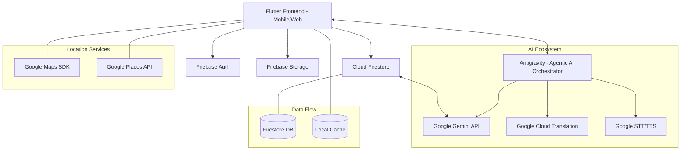

# Community Resource Finder (Kita Hack)

We are **Lepak Team from Monash University**. 

# Installation and Set Up
To use the app, simply download it from the APK link below. You can log in if you want to contribute, or enter in **Guest Mode** to explore available contributions around Malaysia.

### App Download (APK)
You can download the latest release here: https://drive.google.com/file/d/1HT8t5y0QtjliL0eNEFP_fqYn1h6hD9lP/view?usp=sharing 

## Repository Overview
The **Community Resource Finder** is a Flutter application built to connect communities and facilitate the sharing of essential resources. This platform enables users to discover nearby food banks, shelters, and other vital community resources through an interactive map and user-friendly interface.

Our mission is to bridge the gap between resource surplus and local needs, fostering a resilient and supportive community ecosystem through technology.

# Project Overview

### Problem Statement
In Malaysia, vulnerable groups such as low-income families, elderly people living alone and migrant workers often struggle to quickly find nearby and reliable emergency support such as food banks, shelters and community aid during a crisis. Information is scattered across outdated websites, social media posts and closed WhatsApp groups, and is often only available in English, making it difficult to know which services are still operating, whether walk-ins are allowed, or whether the information is trustworthy.<br>
At the same time, volunteers and donors share help informally online, while people in need cannot clearly signal what they need, where they are or when they need it. As a result, help may exist nearby but fails to reach those who need it most, especially outside office hours.

### SDG Alignment
The Community Resources Finder app closes the information gap, ensuring help reaches people quickly and safely.

| Goal | Target | App Alignment |
| :--- | :--- | :--- |
| **🥗 SDG 2: Zero Hunger** | **Target 2.1** | Provides real-time GPS-based discovery of verified food banks and community meal services. In 2023, Food Bank Malaysia distributed >578k kg of food ([ref](https://www.foodbanking.org/global-reach/malaysia/)), yet many still miss out due to lack of information. |
| **💰 SDG 1: No Poverty** | **Target 1.4** | Allows anonymous browsing of shelters and food banks without sign-in, removing intimidation barriers for vulnerable individuals ([ref](https://pubmed.ncbi.nlm.nih.gov/41136927/)). |
| **⚖️ SDG 10: Reduced Inequalities** | **Target 10.2** | Multilingual support and voice navigation ensure inclusion of non-English speakers, elderly, and low-literacy users who are often excluded from digital welfare ([ref](https://pmc.ncbi.nlm.nih.gov/articles/PMC10938227/)). |
| **🏙️ SDG 11: Sustainable Cities** | **Target 11.2** | Coordinates uncoordinated local resources (surplus food, spare rooms, volunteer support) via an AI-moderated map, strengthening local resilience ([ref](https://pmc.ncbi.nlm.nih.gov/articles/PMC6330151/)). |

### Solution description
Community Resources Finder is a Flutter-based mobile app that connects people in need with local support services through an interactive map. Users can search for nearby food banks, shelters, and community aid, view verified details, and get directions. The app supports multiple languages and includes voice navigation to ensure accessibility for elderly and low-literacy users. Volunteers can also post available resources, which are moderated by AI to maintain accuracy. Additionally, users can proactively ask for help through the app, which provides an instant match with available community resources. By bridging information gaps and coordinating local aid, the app strengthens community resilience and ensures help reaches those who need it most, especially outside office hours.

# Key Features 

### **1. Comprehensive Resource Discovery**
Connects users to available help within a **15km radius**:
- **Dual Resource Mapping**: displays official locations (via **Google Places API**) alongside real-time community contributions.
- **Advanced Integration**: uses the **Google Maps SDK for Android** for seamless navigation.
- **Offline Reliability**: includes localized caching to ensure data is available even with unstable connectivity.

### **2. Community-Powered Contributions**
Empowering users to share resources across multiple categories:
- **Diverse Support**: categories include *Food, Shelter, Clothes, Hygiene, Transport, Essential Supplies, and Volunteering*.
- **AI Safety (Gemini)**: integrated **Gemini AI** proactively screens all posts for scams, flagging or removing suspicious content instantly to maintain community trust.

### **3. Smart Request & Matching**
Direct, immediate assistance for those in need:
- **Instant Matching**: users can proactively broadcast a request for help, triggering a smart match against accurate community data for immediate support.
- **AI Fraud Prevention**: **Gemini AI** verifies help requests to prevent abuse and ensure resources go to genuine cases.

### **4. Human-Centered Moderation**
A dedicated **Moderator Dashboard** provides a critical layer of oversight:
- **Manual Verification**: allows trained moderators to perform human checks on flagged content, significantly reducing error and ensuring high-quality resources.

### **5. Universal Accessibility**
Designed to be used by anyone, anywhere:
- **Multilingual Support**: real-time translation for diverse communities.
- **Voice Commands**: hands-free navigation for elderly, low-literacy, or visually impaired users.

# Overview of Technologies used 

### **📱 Framework & Core Stack**
- **Flutter**: unified development for Android and iOS using a single codebase, allowing for much faster iteration than native development.
- **Firebase (Firestore, Auth, Storage)**: powers **all backend data**, real-time sync, secure authentication, and image storage. Compared with traditional SQL backends and custom servers, Firebase provides built-in real-time sync, offline support, and automatic scaling.
- **Google Maps Platform (SDK & Places API)**: provides high-accuracy discovery and verification of help locations with smooth Flutter integration.
- **Google Gemini API**: acts as the primary intelligence layer for understanding natural language and moderating community content more reliably than rule-based systems.

### **🤖 Agentic AI Ecosystem: Antigravity**
- **Developer Backbone**: handles deep codebase analysis, architectural planning, and complex debugging.
- **System Orchestrator**: ensures all AI features—from moderation to voice navigation—are perfectly integrated and optimized.

### **✨ Intelligence Layer & Safety: Google Gemini**
- **Safety Moderation**: analyzes community contributions for potential scams or unsafe content in real-time.
- **Qualitative NLU**: parses natural language voice commands into structured, actionable data that the app can process.

### **🎙️ Hands-Free Interaction (STT/TTS & Gemini)**
- **Speech-to-Text**: converts spoken user input into actionable commands.
- **Intent Execution**: Gemini AI interprets the user's intent to determine the correct app action.
- **Text-to-Speech**: provides real-time spoken feedback on resource discovery and turn-by-turn directions.

### **🌐 Multilingual Inclusion: Google Cloud Translation**
- **High-Accuracy Triage**: provides instant translation for English, Bahasa Malaysia, and Chinese.
- **Optimized Performance**: integrates with a localized caching system to provide immediate results and minimize API overhead.

### **✅ Robust Verification**
- **Multi-Screen Validation**: end-to-end integration is verified across all main screens—*Community, Contribution, and Request Help*—ensuring that moderation, matching, and navigation function reliably in real-world scenarios.

# Implementation Details & Innovation

### **System Architecture**
Our architecture is built for scalability, reliability, and real-time intelligence:



- **Frontend**: A unified Flutter codebase ensures consistent experiences across Android, iOS, and Web.
- **Backend**: Firebase provides the backbone for all data management, including real-time synchronization and secure storage.
- **Agentic Layer**: **Antigravity** acts as the intelligent bridge, managing complex interactions between user intent, translation, and moderation.
- **Location Intelligence**: Google Maps and Places APIs are deeply integrated to provide reliable discovery within a precise 15km radius.

### **User Workflow**
The journey from needing help to receiving aid is streamlined for maximum speed and safety:

1.  **Discovery**: Users enter the app (via Login or **Guest Mode**) and immediately see a map of verified resources and community markers.
2.  **Intent Capture**: Using **Voice Commands** or manual search, users specify their needs (e.g., "Find Halal food banks near me").
3.  **Smart Matching**: The system runs a 15km proximity filter, cross-referencing user requests with live community data and official Google Places.
4.  **Trust & Safety**: Before a request or contribution goes live, the **AI Moderation (Gemini)** screens for scams. Flagged items move to the **Moderator Dashboard** for human review.
5.  **Fulfillment**: Once a match is made, users coordinate via provided contact details. The requester marks the item as "Fulfilled," updating the community map in real-time.

# Challenges Faced

### **1. Resilient AI Pipelines: Self-Healing JSON Parsing**
A major technical challenge was handling inconsistent JSON responses from the Gemini API in our moderation pipeline.
- **The Issue**: During high-volume testing, Gemini responses were occasionally truncated or wrapped in Markdown tokens (```json), causing Dart’s JSON parser to crash and block the Firestore batch writes.
- **The Solution**: We implemented a **self-healing JSON parser**. It uses regex cleaning to strip Markdown and a "brace-count" algorithm to reconstruct truncated structures with default safe values. This reduced pipeline failures from **~5% to <0.01%**, ensuring legitimate aid isn't blocked by minor AI formatting errors.

### **2. Performance vs. Friction (Insights from User Testing)**
Early testing revealed that while users loved the "AI Verified" badges, they were frustrated by performance and "invisible" moderation.
- **The feedback**: Testers highlighted slow loading times and confusion when posts were removed by AI without explanation.
- **The Pivot**: This feedback motivated us to implement **faster localized caching** for map markers and build the **Moderator Dashboard**. By adding a "Human-in-the-Loop" layer, we provided a double safety net that allows users to appeal AI decisions, significantly boosting confidence in the platform's reliability.

### **3. Breaking the "Digital Language Barrier"**
Ensuring inclusivity for Malaysia’s diverse community—including non-technical elderly users and non-English speakers.
- **The Challenge**: Traditional welfare apps are often English-only and require high digital literacy.
- **The Solution**: We integrated a real-time **language toggle** (Bahasa Malaysia, English, and Chinese) and a **voice-assisted UI**. Testers found that the ability to hear resource counts and directions in their native language transformed the app from a "tool" into a "proactive community companion."

# Future Roadmap

Our vision for **Community Resource Finder** focuses on high-impact, realistic features that deepen community trust and technical resilience.

### **Phase 1: Localized Community Impact**
- **AI-Driven Community Insights**: Use **Gemini** to analyze search trends and resource requests to predict "high-need areas," allowing us to alert NGOs before a shortage occurs.
- **Multimodal Requests**: Implement "Photo-to-Request" functionality. Users can upload a photo of an empty pantry, and **Gemini Vision** will automatically categorize and populate the request details.
- **Volunteer Route Optimizer**: Integrate smart-routing for volunteers dropping off multiple contributions, minimizing travel time and environmental impact.

### **Phase 2: Trust & Gamification**
- **Community Hero Program**: A verification-based badge system. Frequent, high-quality contributors earn "Community Hero" status, increasing the visibility and trust of their markers.
- **NGO Dashboard Integration**: Bridging grassroots aid with formal disaster relief by allowing official organizations to "Officialize" community posts.
- **Localized Voice Dialects**: Refining the voice UI to recognize Manglish and other local Malaysian dialects for a truly native intuitive experience.
